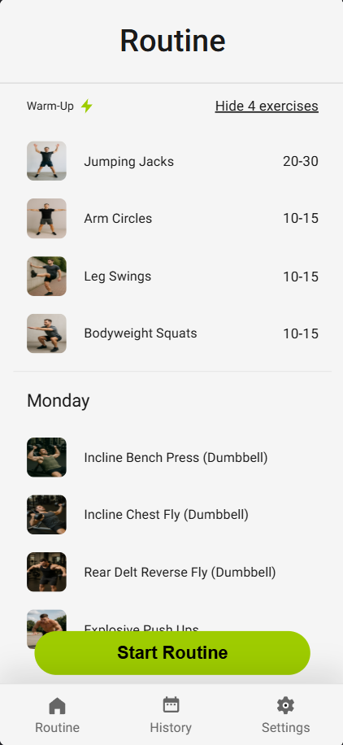

# Fitness Tracker

A workout tracking app built with vanilla JavaScript.

**Mobile-First:** This app is designed for mobile use. For the best experience, open it on your phone or use your browser's mobile view.

## Live Demo

Try the app: [fitness-tracker-app](https://rkentcd.github.io/fitness-tracker-app/)

## Preview

## Why I Built This
I wanted a free, simple way to track my gym workouts without subscriptions.

## Features
- Create custom workout routines
- Track workouts with timer
- View history calendar
- Dark/light theme
- All data saved locally

## How to Run
Open index.html in your browser

## Technologies
- JavaScript (ES Modules)
- CSS3
- HTML5
- localStorage
